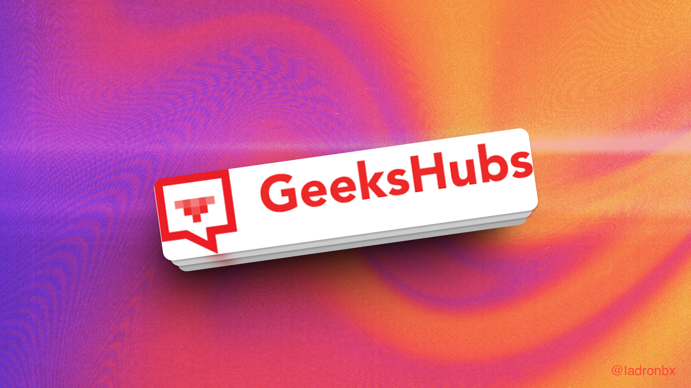

# Katana Sushi - Restaurante Japonés
[Katana Sushi - Restaurante Japonés](https://ladronbx.github.io/)

**Primer proyecto del Bootcamp Full Stack Developer Presencial en la academia GeeksHubs en Valencia**. 

Durante este proyecto, he aplicado los conocimientos adquiridos en la primera semana del Bootcamp, para crear una página web que representa a un restaurante japonés llamado **Katana Sushi**.
A continuación, se describen las principales características:

## Desarrollado con:

- [HTML5](https://lenguajehtml.com/html/)
- [CSS3](https://desarrolloweb.com/manuales/css3.html)
- [Bootstrap](https://getbootstrap.com/)

## Bootstrap

**El proyecto de Katana Sushi se ha desarrollado utilizando el framework de diseño web Bootstrap.**
 Bootstrap es una herramienta de código abierto que ha facilitado la creación de una página web receptiva y estilizada. A continuación, se destacan algunas de las formas en que Bootstrap ha sido utilizado en el proyecto:

- **Dependencias de Bootstrap**: El proyecto utiliza las dependencias de Bootstrap, incluyendo la hoja de estilos CSS y las bibliotecas de JavaScript, que se vinculan directamente desde la CDN de Bootstrap para asegurar un rendimiento óptimo y una experiencia de usuario fluida.
    
    
    
- **Navbar personalizada**: Se ha creado una barra de navegación personalizada que incluye enlaces a diferentes secciones del sitio web. Esta barra de navegación se adapta automáticamente a diferentes tamaños de pantalla gracias a las clases proporcionadas por Bootstrap.
    
    
    
    
- **Tarjetas de producto**: Las tarjetas que se utilizan para presentar los diferentes platos de sushi son componentes de Bootstrap que permiten mostrar de manera atractiva la información del producto, incluyendo una imagen, título, descripción y precio.
    
    

    
- **Diseño responsivo**: Bootstrap ha sido fundamental para garantizar que el sitio web sea completamente responsivo. Esto significa que la página se ajusta de manera óptima a diferentes dispositivos, tanto a pc, como tablets o smartphones.
- **Estilos personalizados**: Aunque Bootstrap proporciona una serie de estilos predeterminados, también se han aplicado estilos personalizados para adaptar la apariencia general del sitio web al tema y la identidad de Katana Sushi.

### **Media Query**

El proyecto incluye media queries para garantizar que la página web se vea y funcione correctamente en pantallas de diferentes tamaños. A continuación, se describen las modificaciones realizadas para pantallas de 1100px o menos:

- El tamaño de fuente se ajusta para una mejor legibilidad en pantallas más pequeñas.
- La imagen se redimensiona automáticamente para ocupar todo el ancho de la pantalla.
- El texto se centra y se ajusta para mantener un diseño atractivo en dispositivos móviles.

    
    
    

## Código Fuente

El código fuente del proyecto se encuentra organizado en varias páginas HTML y archivos CSS. A continuación, se enumeran las páginas principales y los archivos asociados:

- `index.html`: Página principal del sitio web que incluye la información general del restaurante.
- `sushi.html`: Página que muestra la carta de sushi disponible.
- `vinos.html`: Página que presenta la carta de vinos.
- `reserva.html`: Página donde los usuarios pueden realizar reservas.
- `about.html`: Página que proporciona información sobre el restaurante y su equipo.

## Página Principal

- La página principal muestra **información general** del restaurante japonés **Katana Sushi.**
    
    
    
- Un video en blanco y negro de una mujer japonesa se reproduce automáticamente en la página principal.
    
    
    

- Se presentan secciones informativas sobre la filosofía del restaurante, el ambiente acogedor y la variedad de platos que se ofrecen.

    

## Carta Sushi y Carta Vino : Desarrollado con Bootstrap

El proyecto Katana Sushi ha sido desarrollado utilizando el framework de diseño web Bootstrap, y uno de los componentes destacados que he utilizado son las tarjetas (cards) proporcionadas por Bootstrap. Las tarjetas son elementos versátiles que me han permitido mostrar los platos de sushi de manera atractiva y organizada. A continuación proporciono más detalles sobre cómo se he integrado:

- **Tarjetas de Producto**: Cada plato de sushi se presenta en su propia tarjeta. Las tarjetas incluyen una imagen representativa del plato, un título descriptivo, información detallada sobre el plato y su precio. Esta presentación ayuda a los usuarios a obtener rápidamente la información que necesitan sobre nuestros platos.
    
    
    
- **Diseño Responsivo**: Las tarjetas se adaptan automáticamente a diferentes tamaños de pantalla. Esto significa que se verán igual de bien tanto en pc, como en una tablet como en un smartphone. La estructura flexible de las tarjetas de Bootstrap garantiza una experiencia de usuario coherente en todos los dispositivos.
    
    
    
- **Estilos Personalizados**: Aunque he utilizado las tarjetas de Bootstrap como punto de partida, he aplicado estilos personalizados para alinearlas con la identidad y el tema de **Katana Sushi**. Esto ha permitido que se logre un diseño único y atractivo para cada tarjeta de producto.
- **Facilidad de Mantenimiento**: Las tarjetas de Bootstrap son fáciles de personalizar y mantener. Esto permitiría agregar nuevos platos de sushi o actualizar información existente de manera eficiente a medida que el menú cambia o evoluciona.

### **Página de Reserva**

La página de reserva de Katana Sushi permite a los clientes realizar reservas para disfrutar de una experiencia culinaria única. Aquí encontrarás un formulario sencillo que te permite seleccionar la fecha y la hora de tu reserva.

Puedes acceder a esta página de reserva haciendo clic en el enlace "Reserva" en la barra de navegación del sitio web.

**Instrucciones para Reservar:**

1. Ingresa tu nombre y apellidos en los campos correspondientes.
2. Proporciona tu dirección de correo electrónico para que podamos confirmar tu reserva.
3. Selecciona la fecha deseada para tu reserva utilizando el campo de fecha.
4. Elije la hora de tu reserva utilizando el campo de hora.
5. Haz clic en el botón "Reserva" para completar el proceso.

<aside>
⚠️  **Nota** : Actualmente, el proyecto no incluye un mapa de ubicación de Google Maps. Sin embargo, esta característica podría agregarse en futuras actualizaciones del proyecto una vez que se adquiera el conocimiento necesario. ⚠️ 

</aside>

## Sobre Nosotros

- La página 'Sobre Nosotros' muestra **información general** del restaurante japonés **Katana Sushi.**
    
    
    
- Un video en blanco y negro de un cocinero preparando Sushi se reproduce automáticamente en la página principal.
    
    
    

- Se presentan secciones informativas sobre la filosofía del restaurante.

    

## Instrucciones de Uso

Para ver el proyecto en acción, puedes acceder a la página web en línea visitando el siguiente enlace: [Katana Sushi - Restaurante Japonés](https://ladronbx.github.io/)

Si deseas ejecutar el proyecto localmente, sigue estos pasos:

1. Descarga todas las carpetas y archivos del repositorio.
2. Abre el archivo `index.html` en tu navegador web.

## Contribuciones

Este proyecto es público y las contribuciones son bienvenidas. Si deseas contribuir, sigue estos pasos:

1. Realiza un fork del repositorio.
2. Crea una nueva rama para tu contribución.
3. Realiza tus cambios y mejoras.
4. Envía una solicitud de extracción (pull request) para revisar y fusionar tus cambios.

## Contacto

Si tienes preguntas, comentarios o sugerencias, no dudes en ponerte en contacto conmigo a través de [ladronbravovlc@gmail.com](mailto:tu_correo_electronico@gmail.com).

---

## Enlace Github Pages

- [Página Web del Restaurante](https://ladronbx.github.io/)
---